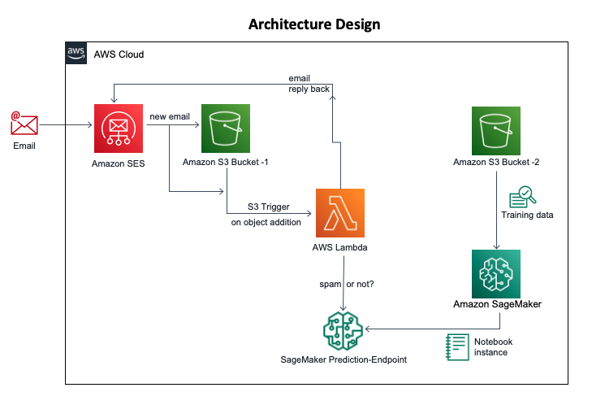

# Domain SMTP Spam Classifier
A machine learning model to predict whether a message is spam or not in a domain configured for SMTP using AWS. The system upon receipt of an email message will automatically flag it as spam or not, based on the prediction obtained from the machine learning model.

# Design


# Setting Up
1. Make sure you have a verified domain in SES.
2. Run the following commands to create a Layer used by lambda function.
    ```
    cd layer
    sh make-layer.sh
    ```
    Running the above commands should create a `lambda.zip` file in the folder. Create a new layer using this called `SpamClassifierLayer`.
3. Run the following command to create a zip for the lambda functions that will be used in this application.
    ```
    sh make-lambda-zips.sh
    ```
    Running the above command should create two zips. Please upload the zips to a S3 bucket and note the name of the bucket.
4. Now create a role in IAM console of AWS for CloudFormation with the following permissions.
    * IAMFullAccess
    * AmazonS3FullAccess
    * AmazonSESFullAccess
    * AmazonEventBridgeFullAccess
    * AWSCloudFormationFullAccess
    * AWSLambda_FullAccess
5. Implement a Machine Learning model for predicting whether an SMS message is spam or not.
    * Follow the following AWS tutorial on how to build and train a spam filter machine learning model using Amazon SageMaker: [Link](https://github.com/aws-samples/reinvent2018-srv404-lambdasagemaker/blob/master/training/README.md)
    * The resulting model should perform well on emails as well, which is what the rest of the assignment will focus on.
    * Deploy the resulting model to an endpoint (E1).